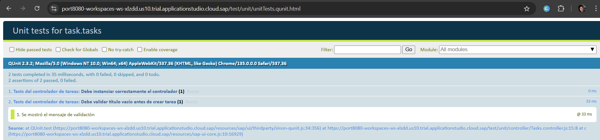

# 📋 Simple Task Manager - SAPUI5 Application

Este proyecto es una aplicación desarrollada con **SAPUI5** que permite gestionar tareas de forma sencilla, siguiendo las mejores prácticas Fiori y empleando arquitectura MVC, OData y componentes inteligentes.

La aplicación fue construida como parte de una prueba técnica para evaluar habilidades en SAPUI5, estructura de proyectos, mock server, navegación y control de vistas, manejo de modelos, y diseño Fiori.

---

## ✅ Funcionalidades principales

- 📄 **Lista de tareas** visualizadas usando `SmartForm`
- 🧩 **Visualización de detalle** por tarea individual
- 🆕 Creación simulada de tareas
- ✏️ Edición de campos: título, descripción, estado
- ❌ Eliminación lógica simulada (con lógica futura)
- 🔁 Navegación entre vistas con `Routing`
- 📦 Datos simulados desde `MockServer` (sin backend real)
- 📐 Interfaz adaptable, responsive y Fiori-compliant

---

## 🛠️ Tecnologías y herramientas usadas

| Recurso                      | Uso                                           |
|-----------------------------|-----------------------------------------------|
| SAPUI5 (OpenUI5)            | Framework principal                          |
| SAP Business Application Studio | Entorno de desarrollo                        |
| OData V2 (MockServer)       | Simulación de servicios y operaciones CRUD   |
| JSON & Metadata.xml         | Datos y definición de modelo OData           |
| SmartForm & SmartField      | Controles inteligentes Fiori                 |
| Routing                     | Navegación entre vistas                      |
| Git                         | Control de versiones                         |

---

---

## 📡 Simulación con MockServer

- Se utiliza `MockServer` para simular una API REST OData V2
- Los datos se generan automáticamente desde `metadata.xml`
- No se requiere archivo `Tasks.json`, aunque puede usarse si se desea
- Se simula el EntitySet: `/Tasks`

---

## 🧪  Prueba unitaria con QUnit:

✔️Testea la función onCreateTask() del controlador.

✔️Simula casos donde el título está vacío.

✔️Usa sinon.spy() para verificar MessageToast.

✔️Simula getView(), getModel() y getOwnerComponent().

---

## 🚀 Cómo correr el proyecto 📌 Requisitos cumplidos del enunciado

---
## 📌 Requisitos cumplidos del enunciado

✔️ Proyecto SAPUI5 MVC en BTP

✔️ Listado y detalle de tareas con navegación entre vistas

✔️ Agregado, edición (parcial) y borrado simulado de tareas

✔️ Datos gestionados vía MockServer simulando OData sin backend real

✔️ Uso de componentes Fiori como SmartForm, SmartField y Table

✔️ UI Responsive y alineada a SAP Fiori Guidelines

✔️ Manejo de errores y validaciones con mensajes de usuario (MessageToast)

✔️ README detallado + pruebas unitarias QUnit opcionales implementadas

✔️ Routing funcional con manifest.json y navegación controlada

---

## 🙋 Autor

**Juan Ostos**  

---

## 📜 Licencia

Proyecto educativo - sin uso comercial.

