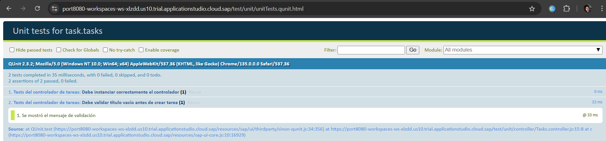
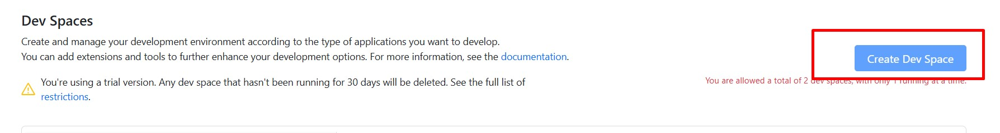
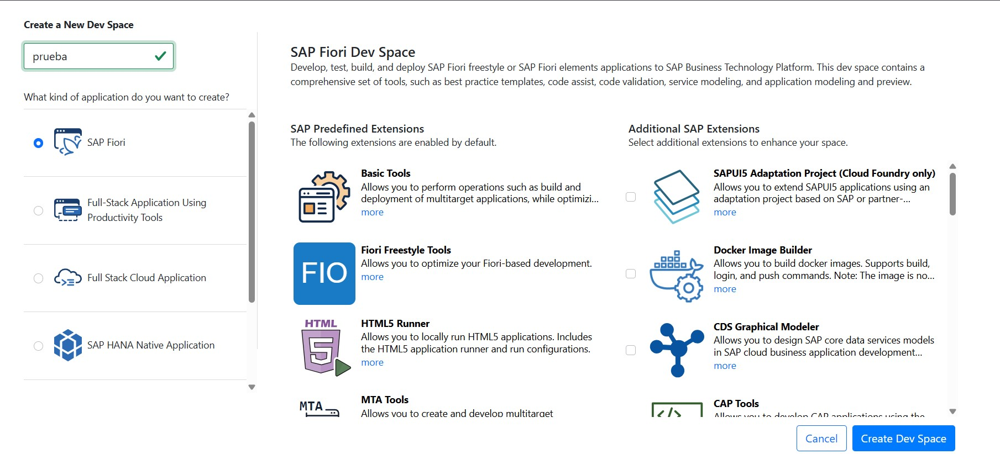
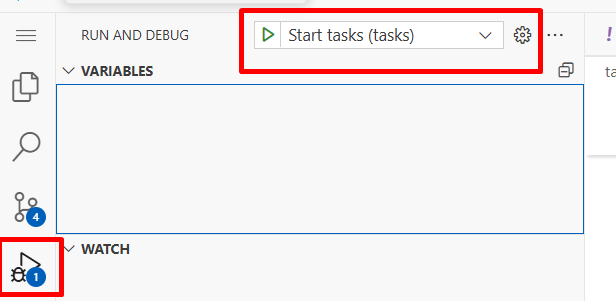
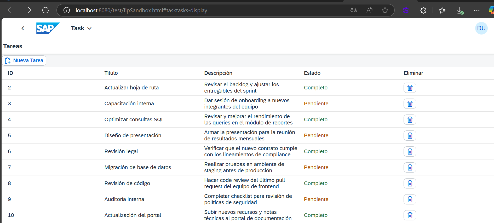

# 📋 Simple Task Manager - SAPUI5 Application

This project is an application developed with **SAPUI5**  that allows for simple task management, following Fiori best practices and using MVC architecture, OData, and smart controls.

The application was built as part of a technical assessment to evaluate skills in SAPUI5, project structure, mock server, view navigation and control, model handling, and Fiori design.

---

## ✅ Main Features

- 📄 Task list displayed using `SmartForm`
- 🧩 Detail view for individual tasks
- 🆕 Simulated task creation
- ✏️ Field editing: Description, status
- ❌ Simulated logical deletion (with future logic planned)
- 🔁 View navigation using Routing
- 📦 Simulated data from MockServer (no real backend) mimicking CRUD
- 📐 Adaptive, responsive, and Fiori-compliant interface

---

## 🛠️ Technologies and Tools Used

| Resource                          | Purpose                                        |
|-----------------------------      |------------------------------------------------|
| SAPUI5 (OpenUI5)                  | Main framework                                 |
| SAP Business Application Studio   | Development environment                    |
| OData V2 (MockServer)             | Service simulation and CRUD operations         |
| JSON & Metadata.xml               | OData model data and definition                |
| SmartForm & SmartField            | Fiori smart controls                           |
| Routing                           | View navigation                                |
| Git                               | Version control                                |

---

---

## 📡 Simulation with MockServer

- MockServer is used to simulate a RESTful OData V2 API
- Data is automatically generated from metadata.xml
- A Tasks.json file is not required, though it can be used optionally
- The simulated EntitySet is: /Tasks

---

## 🧪 Unit Testing with QUnit:

✔️Tests the onCreateTask() function from the controller.

✔️Simulates cases where the title is empty.

✔️Uses sinon.spy() to verify MessageToast.

✔️Mocks getView(), getModel(), and getOwnerComponent().

---

### 🚀 How to Run the Project
## 🧩 SAP BAS

# 1️⃣ Create a New Dev Space

# 2️⃣ Clone the Repository
Open the BAS terminal and run:
git clone https://github.com/ostosjuan/Simple_Task_Manager.git
or use the Fiori application template:

# 3️⃣ Install Dependencies
npm install --save-dev @ui5/cli

# 4️⃣ Test the APP

______________________________________________________________________

### ❎ Another editor (like Visual Studio)
# 1️⃣ Clone the GitHub repository https://github.com/ostosjuan/Simple_Task_Manager.git

# 2️⃣ Install dependencies "npm install --save-dev @ui5/cli"
(NPM — it's important to have Node.js installed)

# 3️⃣ Run locally with the command "npx ui5 serve --config ui5-local.yaml --open test/flpSandbox.html#tasktasks-display"
It will open locally

---
## 📌 Requirements Fulfilled from the Specification

✔️ SAPUI5 MVC project on BTP

✔️ Task listing and detail view with navigation between views

✔️ Simulated task creation, partial editing, and deletion

✔️ Data handled via MockServer simulating OData without a real backend

✔️ Use of Fiori components such as SmartForm, SmartField, and Table

✔️ Responsive UI aligned with SAP Fiori Guidelines

✔️ Error handling and validation with user messages (MessageToast)

✔️ Detailed README + optional QUnit unit tests implemented

✔️ Functional routing with manifest.json and controlled navigation

---

## 🙋 Autor

**Juan Ostos**  

---

