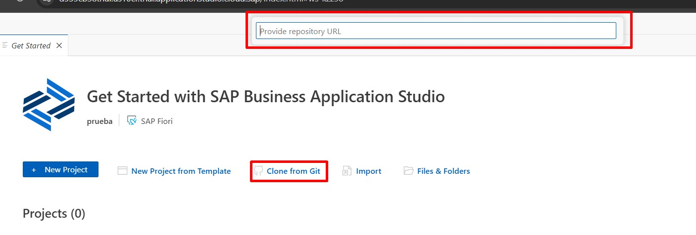

# 📋 Simple Task Manager - SAPUI5 Application

This project is an application developed with **SAPUI5**  that allows for simple task management, following Fiori best practices and using MVC architecture, OData, and smart controls.

The application was built as part of a technical assessment to evaluate skills in SAPUI5, project structure, mock server, view navigation and control, model handling, and Fiori design.

---

## ✅ Main Features

- 📄 Task list displayed using `SmartForm`
- 🧩 Detail view for individual tasks
- 🆕 Simulated task creation
- ✏️ Field editing: Description, status
- ❌ Simulated logical deletion (with future logic planned)
- 🔁 View navigation using Routing
- 📦 Simulated data from MockServer (no real backend) mimicking CRUD
- 📐 Adaptive, responsive, and Fiori-compliant interface

---

## 🛠️ Technologies and Tools Used

| Resource                          | Purpose                                        |
|-----------------------------      |------------------------------------------------|
| SAPUI5 (OpenUI5)                  | Main framework                                 |
| SAP Business Application Studio   | Development environment                    |
| OData V2 (MockServer)             | Service simulation and CRUD operations         |
| JSON & Metadata.xml               | OData model data and definition                |
| SmartForm & SmartField            | Fiori smart controls                           |
| Routing                           | View navigation                                |
| Git                               | Version control                                |

---

---

## 📡 Simulation with MockServer

- MockServer is used to simulate a RESTful OData V2 API
- Data is automatically generated from metadata.xml
- A Tasks.json file is not required, though it can be used optionally
- The simulated EntitySet is: /Tasks

---

## 🧪 Unit Testing with QUnit:

✔️Tests the onCreateTask() function from the controller.
✔️Simulates cases where the title is empty.
✔️Uses sinon.spy() to verify MessageToast.
✔️Mocks getView(), getModel(), and getOwnerComponent().

---

### 🚀 How to Run the Project
## 🧩 SAP BAS

# 1️⃣ Create a New Dev Space

# 2️⃣ Clone the Repository
Open the BAS terminal and run:
git clone https://github.com/ostosjuan/Simple_Task_Manager.git
or use the Fiori application template:

# 3️⃣ Install Dependencies
npm install --save-dev @ui5/cli

# 4️⃣ Test the APP

______________________________________________________________________

### ❎ Otro editor como (Visual Studio)
# 1️⃣ Clonar el repositorio de github https://github.com/ostosjuan/Simple_Task_Manager.git

# 2️⃣ Instalar dependencias "npm install --save-dev @ui5/cli"
(NPM es importante tener node.js)

# 3️⃣ Ejecutar local con el comando "npx ui5 serve --config ui5-local.yaml --open test/flpSandbox.html#tasktasks-display"
Se abrira en local

---
## 📌 Requisitos cumplidos del enunciado

✔️ Proyecto SAPUI5 MVC en BTP

✔️ Listado y detalle de tareas con navegación entre vistas

✔️ Agregado, edición (parcial) y borrado simulado de tareas

✔️ Datos gestionados vía MockServer simulando OData sin backend real

✔️ Uso de componentes Fiori como SmartForm, SmartField y Table

✔️ UI Responsive y alineada a SAP Fiori Guidelines

✔️ Manejo de errores y validaciones con mensajes de usuario

✔️ README detallado + pruebas unitarias QUnit opcionales implementadas

✔️ Routing funcional con manifest.json y navegación controlada

---

## 🙋 Autor

**Juan Ostos**  

---

